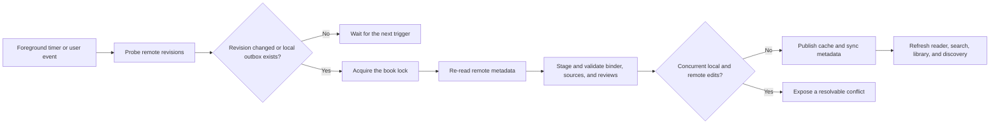

# Bidirectional book sync and reader selection design

## Purpose

Make a remotely edited book an equal participant in Pocket Editor rather than
an input that the device gradually takes ownership of. A remote binder or
Markdown change must refresh the cached book and its open reader without
allowing stale local discovery state to overwrite it. The same work removes
friction from replacing one chapter, keeps the current chapter visible in the
contents panel, renders Markdown soft breaks correctly, and permits review
comments over several paragraphs.

The design is grounded in the `aria` failure:

- `.pocket-editor.json` was changed remotely from v1 chapter paths to
  `chapter-*-v2.md` paths;
- all 28 replacement sources were present remotely;
- the device retained its v1 spine long enough to treat the v2 files as
  discoveries and attempted to synchronize the stale local binder;
- the same sources contain 860 ordinary Markdown soft breaks that the reader
  currently displays as forced line breaks.

The `aria` directory is a read-only reference fixture. Implementation and
tests must not modify it.

## Scope

This design covers three implementation slices in the current
`fix/review-issues-4-5` branch:

1. binder schema, revision monitoring, retry policy, chapter replacement, and
   reactive library state;
2. contents-panel navigation and Markdown soft-break rendering;
3. native multi-block selection for signals and comments.

Each slice must leave working, testable software and may be committed
independently. The slices share the same source mapping and content-change
notification contracts.

## Data flow

Remote revision checks are cheap and lock-free. A full synchronization remains
locked and re-reads remote metadata after acquiring the lock, so the probe is
never treated as a transaction boundary.



Only the locked pass may upload files, confirm merge bases, or publish a new
binder. The monitor only compares remote revisions with the last confirmed
remote revisions and notices durable local outbox work.

## Binder schema v2

The binder remains `.pocket-editor.json`. Schema v2 removes derived chapter
titles from the spine:

```json
{
  "schema_version": 2,
  "book_id": "fb121150-01c1-4797-a20e-ee36d6ced322",
  "title": "aria",
  "chapters": [
    {
      "id": "112e2f0d-afc7-4eb1-9518-e323531da15a",
      "path": "chapter-001-v2.md"
    }
  ],
  "ignored_files": []
}
```

`book_id`, book `title`, ordered `chapters`, and `ignored_files` remain binder
data. Each chapter entry contains exactly `id` and `path`. A decoder accepts
schema v1, validates its existing fields, and discards chapter `title` after
decoding. Encoding always emits schema v2.

Reading a v1 binder does not itself create local pending work. The remote file
is upgraded only when a real local binder mutation next occurs. Once schema v2
has been uploaded, an older APK that requires chapter titles is not compatible
with that book. This is an intentional format transition.

## Derived chapter titles

The displayed and indexed chapter title is derived from the synchronized
Markdown bytes in this order:

1. non-blank `title` in valid YAML frontmatter;
2. the first level-one Markdown heading;
3. the filename without its final `.md` suffix.

One shared title extractor serves import proposals, cached book summaries,
reader titles, contents rows, search indexing, and replacement previews. No
consumer stores a competing chapter-title value.

A binder cannot become visible until every source it references has downloaded,
passed strict UTF-8 validation, and been written durably to the source cache.
After publication, derived titles and the source search index are rebuilt from
that exact cached snapshot.

## Automatic remote revision monitoring

Monitoring runs only while the process is in the foreground and a registered
remote book is open. It checks the book every 60 seconds and also reacts to:

- returning the application to the foreground;
- opening or switching books;
- changing chapters;
- an explicit **Sync now** action;
- network reconnection;
- a new local outbox mutation.

One per-book coordinator serializes probes and sync attempts. Repeated triggers
coalesce; they never create concurrent calls for the same book. A foreground,
navigation, manual, or confirmed-revision trigger may replace a delayed retry
with an immediate attempt.

The probe lists remote files and compares their revision tokens with confirmed
remote metadata. It starts a full sync when any tracked binder, active source,
or active review revision differs, when a tracked file disappears, or when the
local outbox is non-empty. Untracked ordinary Markdown files are discovery
input, not a reason to lock and synchronize the book.

## Locked synchronization and conflict rules

The locked pass lists and downloads remote metadata again. It validates the
remote binder and all sources referenced by the union of the local and remote
spines before publishing any new binder.

The binder follows the existing three-way contract:

- remote changed and local has no binder outbox: accept remote;
- local changed and remote still equals the durable base: upload local;
- both changed from the same durable base: create a binder conflict;
- a required exact base is missing: block upload and require recovery.

Accepting a remote binder writes its sources first, then the binder, merge base,
confirmed revisions, and search index. Content notifications refresh the open
reader and all library-derived UI. The `aria` v2 scenario therefore downloads
the v2 paths and cannot upload v1 in the same pass.

A binder conflict preview shows meaningful spine differences: added, removed,
reordered, and repointed chapter IDs and paths. It does not reduce both sides to
the often-identical book title.

Discovery runs only against a published synchronized binder snapshot. It must
not run immediately after merely enqueuing an asynchronous open sync. A sync
completion notification refreshes book summaries and then recomputes discovery
notices from the new cache.

## Retry and user-visible errors

Errors are classified by whether another attempt can correct them.

| Condition | Behavior |
|---|---|
| Offline, timeout, server failure, or rate limit | Keep pending work and retry automatically |
| Upload accepted but not yet observable | Re-probe and retry automatically |
| Lock temporarily held by another valid session | Retry automatically while showing a quiet waiting state |
| Candidate-lock cleanup cannot yet be confirmed | Re-probe and retry; never ask the user to clear a timeout |
| Authorization missing or revoked | Stop and request sign-in |
| Invalid binder, invalid UTF-8, or a missing referenced source | Stop without replacing the last valid cache |
| Concurrent binder or review edits | Stop and expose a resolvable conflict |
| Missing durable merge base | Stop and expose recovery rather than uploading blindly |

Retryable failures use exponential backoff capped at the existing WorkManager
maximum. There is no terminal attempt count. The UI represents these cases as
**Waiting to sync** and does not show repeated timeout errors. Logs remain
redacted and retain the error class, sync phase, and retry attempt for
diagnostics.

## Replacing one chapter

Every new-file discovery card offers three actions:

- **Add as a new chapter**;
- **Replace chapter…**;
- **Ignore**.

Replacement opens a chapter picker with the currently open chapter selected by
default. Confirmation performs one binder mutation:

1. download and validate the selected new source;
2. keep the target chapter ID and replace only its path;
3. remove the new path from `ignored_files`;
4. add the old path to `ignored_files` so a retained v1 source is not proposed
   again;
5. derive the new title from the cached replacement source;
6. copy an existing review document to the new sidecar path and update its
   `source_path`;
7. write the new binder outbox record against the exact current merge base;
8. publish content notifications and enqueue immediate synchronization.

The operation does not delete the old Markdown or review sidecar from Yandex
Disk. Existing review anchors are resolved against the replacement source.
Matches remain active; non-matches use the current re-anchor workflow rather
than being discarded.

Reading position remains attached to the chapter ID. If its byte offset is not
valid in the replacement source, navigation clamps it to the nearest valid
block and byte boundary.

Before uploading, normal three-way binder synchronization runs again. A remote
change made during the replacement flow becomes a conflict instead of being
overwritten.

## Reactive contents panel

The contents panel observes published binder changes rather than relying on the
book list captured when the controller started. A successful sync or local
binder mutation refreshes the library summaries, current reader neighbors,
contents rows, search titles, and discovery notices from one cached snapshot.

The chapter list owns a keyed lazy-list state. On first opening, it starts at
the current chapter. If the current chapter changes while the panel remains
composed, it scrolls that row into view. Empty or removed chapter IDs fall back
to the first chapter without crashing.

The horizontal book-shortcut row is removed. Book switching remains available
through **Manage books**, leaving more vertical room for search and chapters.

## Markdown line-break semantics

CommonMark parser nodes determine display behavior:

- `SoftLineBreak` renders as one ordinary space;
- `HardLineBreak` renders as `\n` whether it came from two trailing spaces or a
  trailing backslash;
- code-block, table, and other structural block line breaks remain unchanged.

Replacing a raw soft-break newline with a displayed space does not discard
source provenance. Its two display boundaries map to the raw newline's start
and end bytes. A selection that crosses the space therefore produces a raw
range containing the original newline. Anchors and exact-source search continue
to operate on source bytes rather than normalized display text.

## Multi-block selection

The project updates the stable Compose BOM from `2026.06.00` to `2026.08.00`,
which supplies Compose Foundation 1.12 and its public `SelectionState` API. One
`SelectionContainer` owns the reader's selectable block texts. Review cards,
controls, list markers, and footnote popovers are wrapped in `DisableSelection`.

Selectable blocks carry enough block identity and display-to-byte metadata to
map `SelectionState.selectedTexts` back to one document range. A cross-block
selection consists of:

- a suffix of the first selected block;
- every complete intermediate selected block and its raw separators;
- a prefix of the last selected block.

The mapper validates visual order, rejects hidden or synthetic-only endpoints,
and returns one `RawRange` spanning the original source bytes. The selected
text stored in a review record is sliced from those bytes, preserving Markdown
syntax and paragraph separators exactly.

Single-block selection continues to offer signals and edits. Cross-block
selection offers all signal types and comments but omits **Suggest edit**.
The existing edit validator never receives a cross-block range.

The selection flyout is positioned from the visible selected endpoint. Layout
changes and scrolling recompute its bounds. Selected lazy items remain pinned
during handle movement; instrumentation tests cover selection across adjacent
blocks and an auto-scrolled third block.

## Failure safety

The last valid cache stays readable throughout remote validation, retry, and
conflict handling. A malformed remote binder, missing referenced source,
invalid UTF-8 file, interrupted download, or failed durable write cannot publish
a partial new spine.

Replacement and sync mutations retain their durable outbox and merge-base
records until remote confirmation. Process death or cancellation may repeat an
idempotent step but cannot silently mark an unconfirmed upload as saved.

The monitor stops when the app leaves the foreground or no remote book is open.
It stores no source content and never changes user files directly.

## Test strategy

Implementation follows red-green-refactor cycles. Tests assert behavior rather
than implementation symbols.

### Binder and sync unit tests

- schema v1 decodes and derives titles while schema v2 encoding omits chapter
  titles;
- a remote binder replacing every path with `*-v2.md` and no local binder
  outbox is accepted without any upload;
- sources are durable before the remote binder is published;
- simultaneous local and remote binder mutations create a descriptive conflict;
- sync completion refreshes library and discovery state;
- retryable failures remain pending and schedule another attempt indefinitely;
- authorization, invalid remote data, and true conflicts do not retry blindly;
- overlapping monitor triggers produce one per-book operation.

### Chapter and navigation tests

- title extraction follows frontmatter, H1, then filename precedence;
- replacement preserves chapter ID, review content, and reading position while
  changing path and ignored-file membership;
- replacement against a changed remote base conflicts instead of uploading;
- the contents list starts at and follows the current chapter;
- no book-shortcut row is rendered.

### Markdown and selection tests

- soft breaks display as spaces with raw newline byte boundaries;
- both CommonMark hard-break forms display as newlines;
- code-block line breaks remain intact;
- UTF-8 selections spanning two and three blocks map to exact source bytes;
- signal creation accepts a cross-block range;
- edit creation is absent for a cross-block range;
- review cards and controls never enter selected text;
- system handles remain usable while the reader scrolls.

The final verification runs unit tests, `lintDebug`, and Android-test
compilation. Targeted selection, contents, and replacement instrumentation tests
run on an available emulator. If no emulator is available, that limitation is
reported explicitly rather than treating compilation as runtime proof.

## Non-goals

- Pocket Editor does not edit canonical Markdown contents on the device.
- Replacement does not delete remote source or sidecar files.
- This work does not add arbitrary nested source paths to the binder.
- Cross-block source replacement is intentionally unsupported.
- The `aria` reference directory is not converted or rewritten by development
  tooling.

## References

- [SelectionState API](https://developer.android.com/reference/kotlin/androidx/compose/foundation/text/selection/SelectionState)
- [SelectionContainer API](https://developer.android.com/reference/kotlin/androidx/compose/foundation/text/selection/SelectionContainer.composable)
- [Compose BOM guidance](https://developer.android.com/develop/ui/compose/bom)
